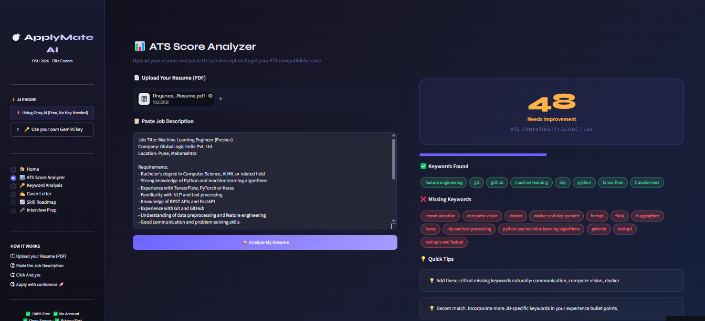
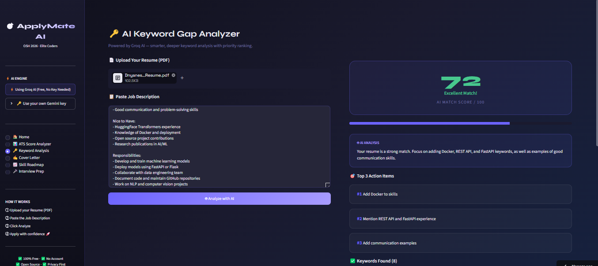
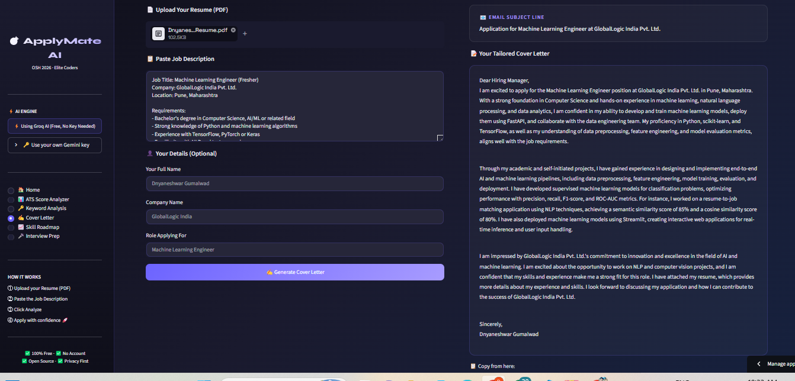
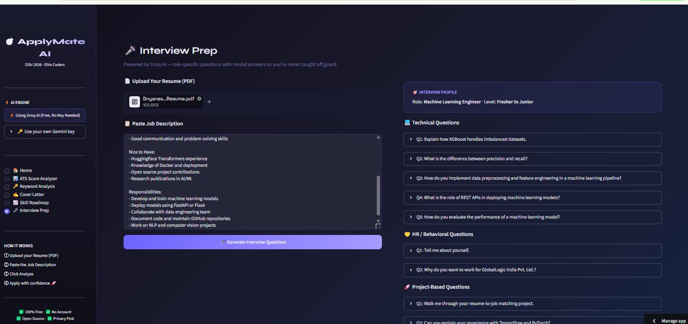

# 🎯 ApplyMate AI

<div align="center">

### **The only open-source, end-to-end AI job application assistant.**

[](https://applymate-ai.streamlit.app)
[](https://python.org)
[](https://streamlit.io)
[](https://groq.com)
[](LICENSE)
[](https://oshack.xyz)

**Paste a Job Description + Resume → Get ATS Score, Keyword Fixes, Cover Letter, Skill Gap Roadmap & Interview Questions.**

**All free. No account. No data stored. No API key needed.**

[🚀 Try Live App](https://applymate-ai.streamlit.app) · [⭐ Star this Repo](https://github.com/gumalwaddnyaneshwar/applymate-ai) · [🐛 Report Bug](https://github.com/gumalwaddnyaneshwar/applymate-ai/issues)

</div>

---

## 🖼️ Screenshots

### 📊 ATS Score Analyzer
> Upload your resume + paste a JD → get instant ATS compatibility score with missing keywords and improvement tips.



### 🔑 AI Keyword Gap Analyzer — 72/100 Excellent Match!
> Groq AI analyzes your resume vs JD and gives priority-ranked keyword suggestions with action items.



### ✍️ AI Cover Letter Generator
> Generates a professional, tailored cover letter with email subject line in seconds.



### 🎤 Interview Prep
> Role-specific technical, HR, and project-based questions with model answers.



---

## ❓ Why ApplyMate AI?

> **"Why not just use Jobscan or Enhancv?"**

Every existing tool stops halfway. ApplyMate AI completes the **entire application pipeline** in one place — completely free, no account, no API key needed.

| Feature | Jobscan | Enhancv | Others | **ApplyMate AI** |
|---------|:-------:|:-------:|:------:|:----------------:|
| ATS Score | ✅ | ❌ | ✅ | ✅ |
| AI Keyword Analysis | ❌ | ❌ | ❌ | ✅ |
| Cover Letter Generator | ❌ Paid | ❌ | ❌ | ✅ |
| Interview Q&A Generator | ❌ | ❌ | ❌ | ✅ |
| Skill Gap Roadmap | ❌ | ❌ | ❌ | ✅ |
| Indian Job Market Support | ❌ | ❌ | ❌ | ✅ |
| 100% Free Forever | ❌ | ❌ | ❌ | ✅ |
| No API Key Needed | ❌ | ❌ | ❌ | ✅ |
| Open Source | ❌ | ❌ | ❌ | ✅ |
| No Data Stored | ❌ | ❌ | ❌ | ✅ |

---

## ✨ Features

### 📊 1. ATS Score Analyzer
- Upload resume (PDF) + paste any Job Description
- Get instant **ATS compatibility score (0–100)**
- See exactly where you're losing points
- Works instantly — no API key needed

### 🔑 2. AI Keyword Gap Analyzer
- **Smarter than basic keyword matching** — understands context
- Detects missing Critical / Important / Optional keywords
- Gives specific suggestions for each missing keyword
- Powered by **Groq AI (Llama 3.3 70B)**

### ✍️ 3. AI Cover Letter Generator
- Generates a **tailored, professional cover letter** for each JD
- Matches tone and keywords from the job description
- Includes email subject line + key strengths highlighted
- One-click copy to clipboard

### 📈 4. Skill Gap Roadmap
- Identifies your **job readiness score** (%)
- Lists skills you have vs skills you need
- Provides **free learning resources** (YouTube, docs, courses)
- Week-by-week action plan to become interview-ready

### 🎤 5. Interview Prep
- Generates **role-specific technical questions** based on the JD
- HR/behavioral questions with model answers
- Project-based questions tailored to your resume
- Quick interview tips for the specific role

---

## ⚡ AI Engine

ApplyMate AI uses **Groq AI** as the default engine:
- ✅ **14,400 requests/day** free tier
- ✅ **No user API key needed** — works out of the box
- ✅ **Super fast** responses (faster than ChatGPT)
- ✅ Powered by **Llama 3.3 70B** model

> Want to use your own Gemini API key? Enter it in the sidebar under "🔑 Use your own Gemini key" for unlimited personal usage.

---

## 🛠️ Tech Stack

```
ApplyMate AI
├── Frontend        → Streamlit (Python)
├── Resume Parsing  → PyPDF2 + pdfplumber
├── AI Engine       → Groq API (Llama 3.3 70B) — Default
├── Alt AI Engine   → Google Gemini 2.0 Flash — Optional
├── Deployment      → Streamlit Cloud (Free)
└── Language        → Python 3.10+
```

---

## 🚀 Quick Start

### Option 1: Use the Live App (Recommended)
👉 **[applymate-ai.streamlit.app](https://applymate-ai.streamlit.app)**

No installation needed! Just open and use.

### Option 2: Run Locally

```bash
# 1. Clone the repository
git clone https://github.com/gumalwaddnyaneshwar/applymate-ai.git
cd applymate-ai

# 2. Install dependencies
pip install -r requirements.txt

# 3. Set up environment variables
cp .env.example .env
# Add your Groq API key to .env

# 4. Run the app
streamlit run src/app.py
```

Get your free Groq API key at: **[console.groq.com](https://console.groq.com)**

---

## 📁 Project Structure

```
applymate-ai/
├── src/
│   ├── app.py              # Main Streamlit app (all 5 modules)
│   ├── ai_helper.py        # Groq + Gemini AI helper functions
│   ├── ats_scorer.py       # ATS scoring engine (no API needed)
│   ├── keyword_analyzer.py # AI keyword gap analyzer
│   ├── cover_letter.py     # AI cover letter generator
│   ├── skill_roadmap.py    # AI skill roadmap builder
│   ├── interview_prep.py   # AI interview Q&A generator
│   └── utils.py            # PDF parsing helpers
├── assets/                 # Screenshots for README
├── .streamlit/
│   └── config.toml         # Streamlit theme config
├── sample_data/
│   └── sample_jd.txt       # Sample job description for testing
├── .env.example            # Environment variable template
├── requirements.txt        # Python dependencies
├── LICENSE                 # MIT License
└── README.md               # This file
```

---

## 🗺️ Roadmap

- [x] ATS Score Analyzer
- [x] AI Keyword Gap Analyzer (Groq powered)
- [x] AI Cover Letter Generator (Groq powered)
- [x] AI Skill Gap Roadmap (Groq powered)
- [x] AI Interview Prep (Groq powered)
- [x] Deploy to Streamlit Cloud
- [x] Groq AI integration (no user API key needed)
- [x] Optional Gemini API key support
- [ ] LinkedIn profile input support
- [ ] Multi-language support (Hindi + English)
- [ ] Resume rewrite suggestions
- [ ] Chrome Extension

---

## 🤝 Contributing

Contributions are welcome! This project was built during the **Open Source Hackathon 2026 by Elite Coders**.

1. Fork the repo
2. Create your feature branch (`git checkout -b feature/amazing-feature`)
3. Commit your changes (`git commit -m 'Add amazing feature'`)
4. Push to the branch (`git push origin feature/amazing-feature`)
5. Open a Pull Request

---

## 👨‍💻 Author

**Dnyaneshwar Gumalwad**
BCA in AI/ML | JSPM University, Pune

[](https://linkedin.com/in/gumalwaddnyaneshwar)
[](https://github.com/gumalwaddnyaneshwar)
[](https://ijarsct.co.in/Paper35343.pdf)

---

## 📄 License

This project is licensed under the **MIT License** — see the [LICENSE](LICENSE) file for details.

---

<div align="center">

### 🏆 Built for Open Source Hackathon 2026 · Elite Coders · [oshack.xyz](https://oshack.xyz)

**If this project helped you, please ⭐ star the repo!**

</div>
